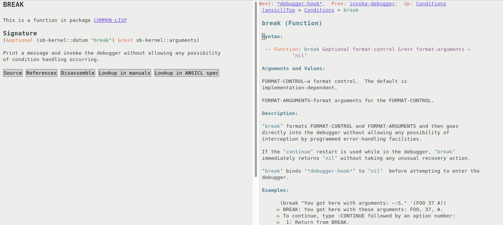
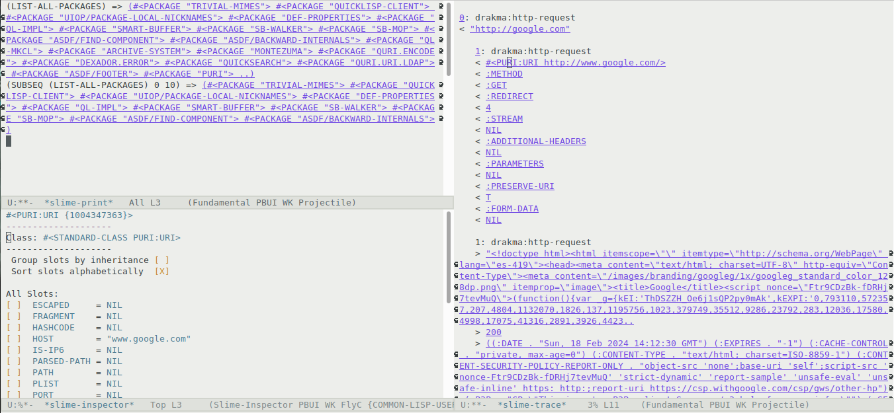

# SLIME ⭐

Overview
--------

This is a [SLIME](https://slime.common-lisp.dev/) configuration that provides the following contribs:

- [Lisp System Browser](https://github.com/mmontone/lisp-system-browser)
- [SLIME Doc Contribs](https://github.com/mmontone/slime-doc-contribs)
- [Quicklisp Systems](https://github.com/mmontone/quicklisp-systems)
- [Quicksearch utility](https://github.com/tkych/quicksearch)
- [SLIME Breakpoints](https://github.com/mmontone/slime-breakpoints)
- [Quicklisp apropos](https://github.com/mmontone/quicklisp-apropos)
- [SLIME Critic](https://github.com/mmontone/slime-critic)
- Use [dedicated Emacs buffers](#dedicated-emacs-buffers-for-output-streams) for output streams.
- Interactive [trace and print buffers](#interactive-trace-and-print-buffers).
- Inspect objects from their printed representation in [output streams](#output-stream-inspector).
- [Access to dpans3 based ANSICL spec](#improved-documentation-mode) in Emacs Info format.

It also adds some custom utilities and menus.

Install
-------

⚠️ **This is ALPHA software**

Clone this repository using --recursive option (this repo has git submodules):

```
git clone --recursive https://github.com/mmontone/slime-star.git
```

Install some dependencies from Quicklisp:

```lisp
(ql:quickload '(:asdf :alexandria :anaphora :drakma :dexador :fiveam :closer-mop :iterate :do-urlencode :yason :html-entities :slite :montezuma :chipz :archive :string-case :lisp-critic))
```

In your `.emacs`:

```elisp
;; Setup load-path, autoloads and your lisp system
(add-to-list 'load-path "~/dir/to/cloned/slime-star")

;; Add slime-star to slime-contribs:
(setq slime-contribs '(slime-fancy slime-star))
```

### Try via Docker

From `docker` directory run:

- `make build`
- `make run`

## Configuration

You'll need to `M-x customize-group slime-star` and `M-x customize-group slime-breakpoints` to enable some of the features (experimental and opinionated features are disabled by default). And then restart Emacs (not all changes are immediatly applied).

## Screenshots

### System browser


### Quickload with completion


### Breakpoints, stepping, toolbars, evaluation and locals navigation


### Improved documentation mode



### Critic


### Quicklisp system browsing


### Dedicated Emacs buffers for output streams

Use:

- `M-x slime-toggle-output-buffer` to send `*standard-output*` to an Emacs buffer.
- `M-x slime-toggle-error-buffer` to send `*error-output*` to an Emacs buffer.
- `M-x slime-toggle-trace-buffer` to send `*trace-output*` to an Emacs buffer.

### Interactive TRACE and PRINT buffers

#### Trace buffer

Toggle functions for tracing using `C-c M-t`. After traced functions are called an interactive Emacs buffer appears, from where it is possible to inspect the traces, interactively.



#### Print buffer

For debugging, insert a call to `swank-print-buffer:prn` in what you want to get printed for inspection. An Emacs buffer opens from where it is possible to inspect the printed value. 

### Output stream inspector

**EXPERIMENTAL**

SLIME does not provide a way of inspecting objects printed to output streams; say an object is printed to some stream: `#<PERSON {100587C0C3}>`, there's no way to access and inspect the object printed.

SLIME ⭐ comes with an extension for inspecting objects that are printed to output streams. To enable, evaluate in Lisp: `(setf stream-inspector:*persistent-pointers* t)`. Then from emacs, move the cursor to some printed object, and `M-x slime-inspect-printed`.

License
-------

SLIME :star: is free software. All files, unless explicitly stated otherwise, are public domain.
