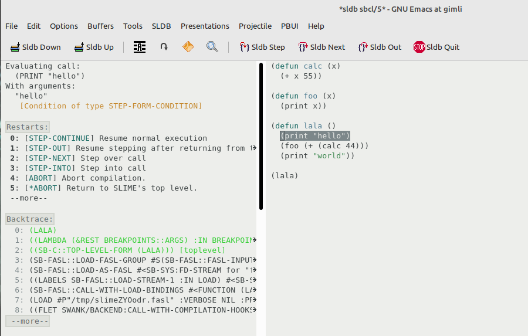

# SLIME ⭐

Overview
--------

This is a [SLIME](https://slime.common-lisp.dev/) configuration that provides the following contribs:

- [Lisp System Browser](https://github.com/mmontone/lisp-system-browser)
- [SLIME Doc Contribs](https://github.com/mmontone/slime-doc-contribs)
- [Quicklisp Systems](https://github.com/mmontone/quicklisp-systems)
- [Quicksearch utility](https://github.com/tkych/quicksearch)
- [SLIME Breakpoints](https://github.com/mmontone/slime-breakpoints)
- Inspect objects from their printed representation in output streams.

It also adds some custom utilities and menus.

Install
-------

⚠️ **This is ALPHA software**

Clone this repository using --recursive option (this repo has git submodules):

```
git clone --recursive https://github.com/mmontone/slime-star.git
```

Install some dependencies from Quicklisp:

```lisp
(ql:quickload '(:asdf :alexandria :anaphora :drakma :dexador :fiveam :closer-mop :iterate :do-urlencode :yason :html-entities :slite))
```

In your `.emacs`:

```elisp
;; Setup load-path, autoloads and your lisp system
(add-to-list 'load-path "~/dir/to/cloned/slime-star")

;; Add slime-star to slime-contribs:
(setq slime-contribs '(slime-fancy slime-star))
```

## Configuration

You'll need to `M-x customize-group slime-star` and `M-x customize-group slime-breakpoints` to enable some of the features (experimental and opinionated features are disabled by default). And then restart Emacs (not all changes are immediatly applied).

## Screenshots




## Output stream inspector

**EXPERIMENTAL**

SLIME does not provide a way of inspecting objects printed to output streams; say an object is printed to some stream: `#<PERSON {100587C0C3}>`, there's no way to access and inspect the object printed.

SLIME ⭐ comes with an extension for inspecting objects that are printed to output streams. To enable, evaluate in Lisp: `(setf stream-inspector:*persistent-pointers* t)`. Then from emacs, move the cursor to some printed object, and `M-x slime-inspect-printed`.

License
-------

SLIME :star: is free software. All files, unless explicitly stated otherwise, are public domain.
