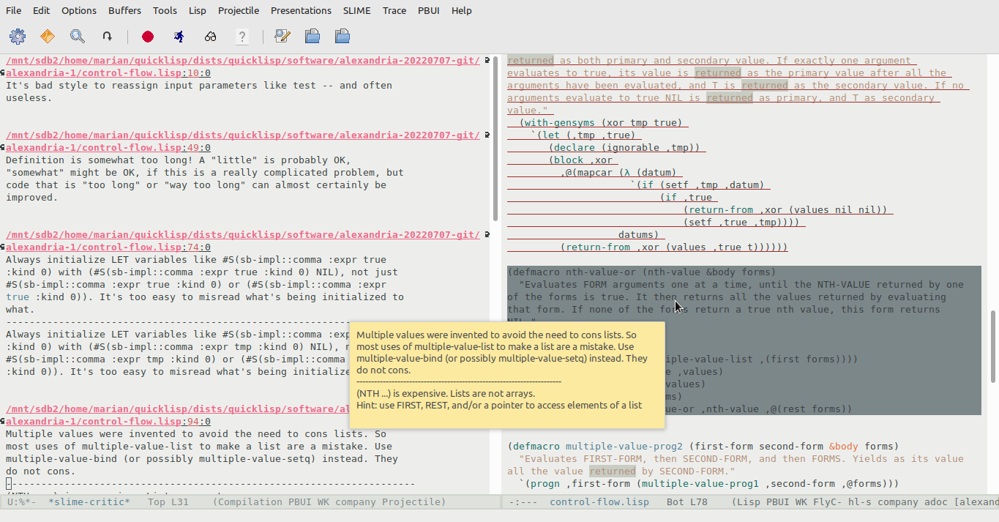

# SLIME-CRITIC

SLIME extension for [lisp-critic](https://github.com/g000001/lisp-critic "lisp-critic").

The Lisp Critic scans your code for instances of bad Lisp programming practice. 



## Install

ℹ️ Please consider using [SLIME :star:](https://github.com/mmontone/slime-star), that comes with this extension preinstalled.

Load `swank` and add this repository path to `swank::*load-path*`, in your Lisp compiler init file (~/.sbclrc if using SBCL):

```lisp
(require :swank)
(push #p"/home/marian/src/lisp/slime-critic/" swank::*load-path*)
```

In Emacs, add this repository path to `load-path` and add `slime-critic` to `slime-contribs` in `~/.emacs` init file, like:

```
(push "/home/marian/src/lisp/slime-critic" load-path)

(add-to-list 'slime-contribs 'slime-critic)

(slime-setup)
```

## Use

- `M-x slime-critic-critique-buffer`: critique the current buffer.
- `M-x slime-critic-critique-file`: critique a file.

## License

GPL
